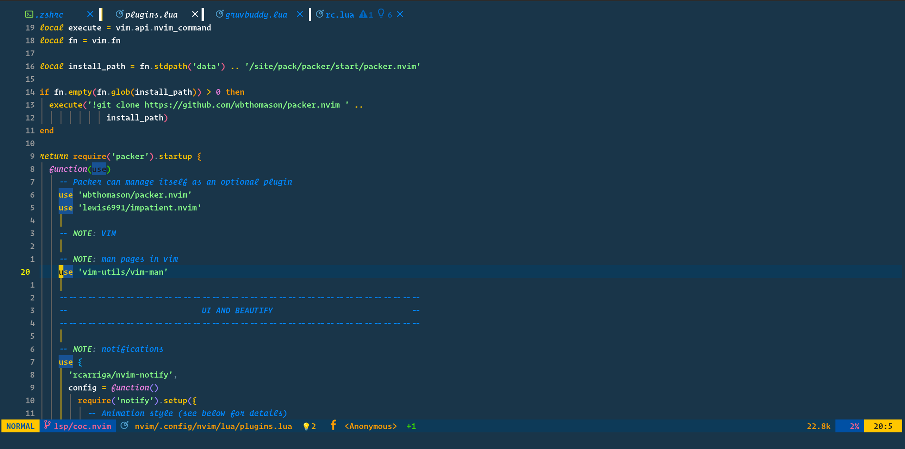
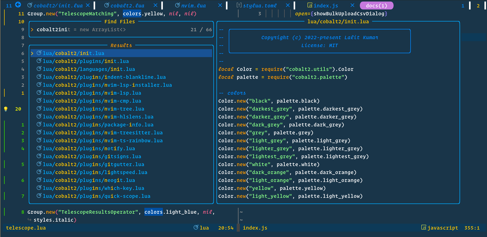
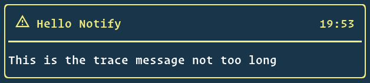
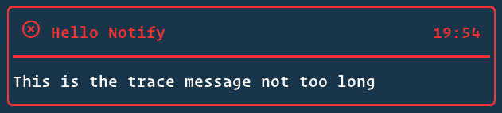
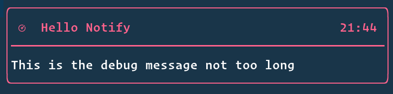
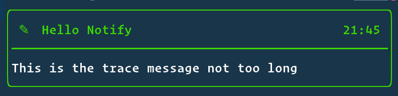
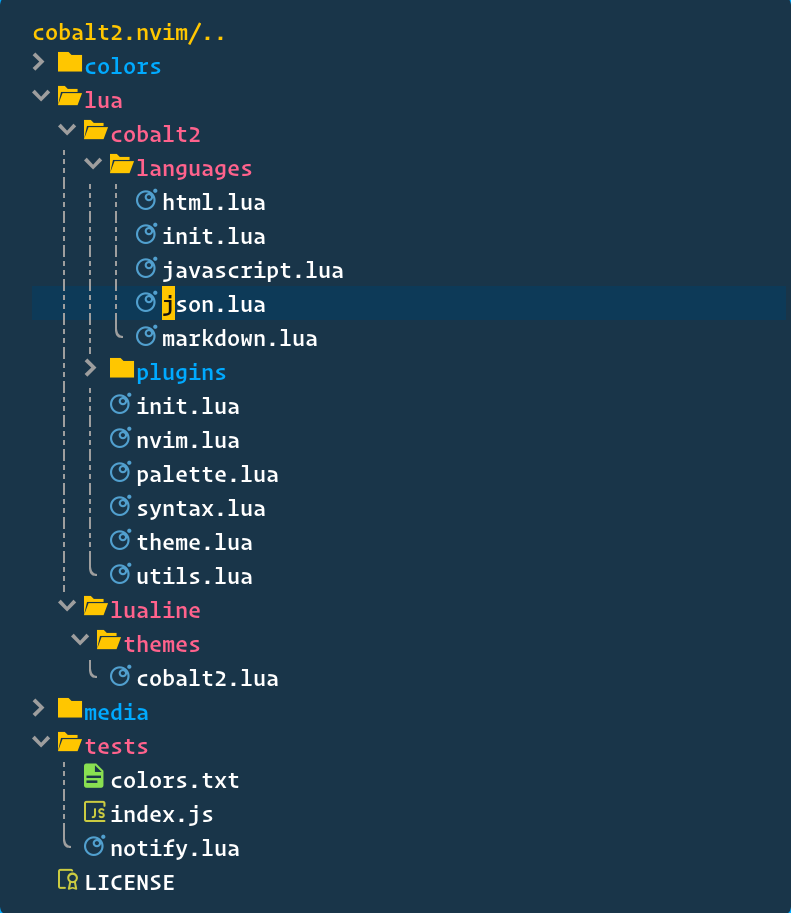
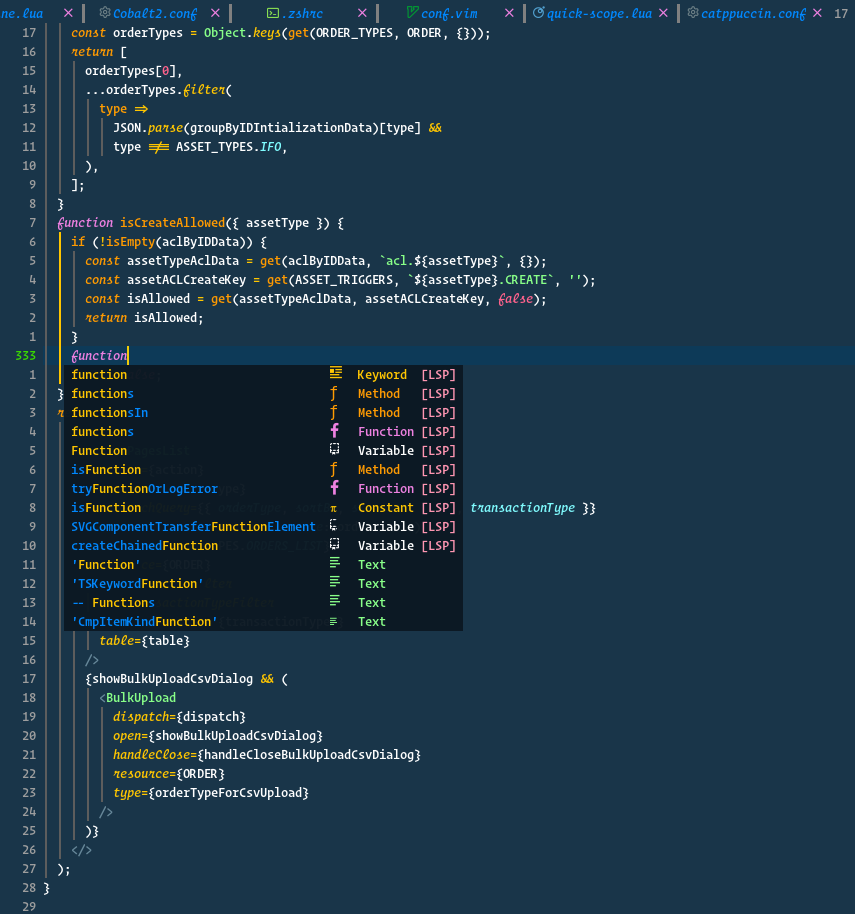
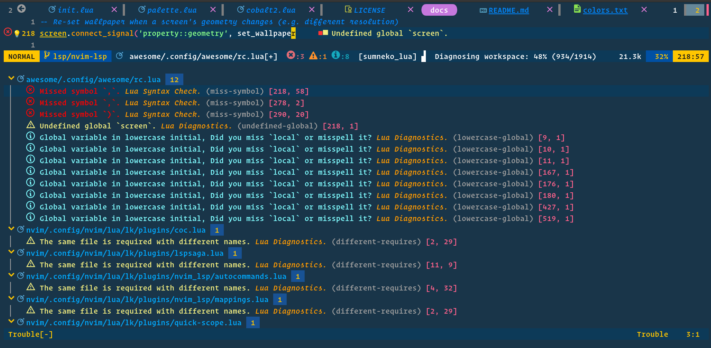

<div align="center">

# cobalt2.nvim

##### Don't stress your eyes now

[](http://www.lua.org)
[](https://github.com/lalitmee/cobalt2.nvim/blob/main/LICENSE)
[](https://github.com/lalitmee/cobalt2.nvim/stargazers)

</div>

cobalt2 theme for neovim in lua using [tjdevries/colorbuddy](https://github.com/tjdevries/colorbuddy.nvim)



##### Table of content

- [Features](#features)
- [Installation](#installation)
- [Usage](#usage)
- [Screenshots](#screenshots)
- [Contributing](#contributing)
- [Acknowledgements](#acknowledgements)

## Features

- Support for the following plugins:
  - [barbar.nvim](https://github.com/romgrk/barbar.nvim)
  - [gitsigns.nvim](https://github.com/lewis6991/gitsigns.nvim)
  - [hop.nvim](https://github.com/phaazon/hop.nvim)
  - [indent-blankline.nvim](https://github.com/lukas-reineke/indent-blankline.nvim)
  - [lightspeed.nvim](https://github.com/ggandor/lightspeed.nvim)
  - [lualine.nvim](https://github.com/nvim-lualine/lualine.nvim)
  - [neo-tree](https://github.com/nvim-neo-tree/neo-tree.nvim)
  - [neogit](https://github.com/TimUntersberger/neogit)
  - [nvim-cmp](https://github.com/hrsh7th/nvim-cmp)
  - [nvim-lspconfig](https://github.com/neovim/nvim-lspconfig)
  - [nvim-notify](https://github.com/rcarriga/nvim-notify)
  - [nvim-tree.lua](https://github.com/kyazdani42/nvim-tree.lua)
  - [nvim-ts-rainbow](https://github.com/p00f/nvim-ts-rainbow)
  - [package-info.nvim](https://github.com/vuki656/package-info.nvim)
  - [packer.nvim](https://github.com/wbthomason/packer.nvim)
  - [telescope.nvim](https://github.com/nvim-telescope/telescope.nvim)
  - [tree-sitter](https://github.com/tree-sitter/tree-sitter)
  - [trouble.nvim](https://github.com/folke/trouble.nvim)
  - [vim-gitgutter](https://github.com/airblade/vim-gitgutter)
  - [vim-sneak](https://github.com/justinmk/vim-sneak)
  - [which-key.nvim](https://github.com/folke/which-key.nvim)

## Installation

```lua
use { 'lalitmee/cobalt2.nvim', requires = 'tjdevries/colorbuddy.nvim' }
```

## Usage

Use the colorscheme by adding these lines according to your config:

- Vim-Script

```vim
lua require('colorbuddy').colorscheme('cobalt2')
```

- Lua

```lua
require('colorbuddy').colorscheme('cobalt2')
```

## Screenshots

- telescope.nvim

  

- nvim-notify

  - info
    
  - warn
    
  - error
    
  - debug
    
  - trace
    

- nvim-tree.lua

  

- lualine.nvim

  
  
  
  
  

- nvim-cmp

  

- trouble.nvim

  

## Contributing

All contributions are welcome! Just open a pull request. Please read [this](https://cbea.ms/git-commit)
before creating your pull request and follow this to write your commit messages.

## Acknowledgements

- [tjdevries/colorbuddy](https://github.com/tjdevries/colorbuddy.nvim)
- [GertjanReynaert/cobalt2-vim-theme](https://github.com/GertjanReynaert/cobalt2-vim-theme)
- [https://github.com/wesbos/cobalt2-vscode](https://github.com/wesbos/cobalt2-vscode)
